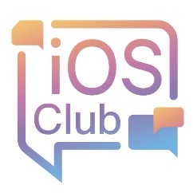

# SwiftUI Learning Projects 👀

This repository contains practice example projects during my SwiftUI learning journey. 

It serves as a testament to my progress in mastering SwiftUI, while also helping me maintain consistent learning habits, structured study cycles, and organized code management. 

Building this foundation will support my continued growth in the field of computer science.

Finally, I hope to become a high-quality outstanding professional in the future! Thank you for reading.

## About Me 😘
- Name: Jackthin Shin
- WeChat: jackthinshin  
- QQ: 1183572035  
- Mobile: 13656694447
